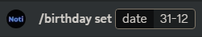
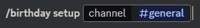
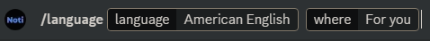
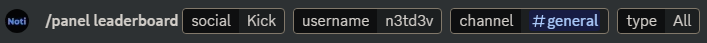
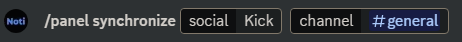
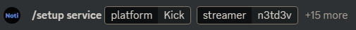

# Commands

On this page you will see a complete list of Noti's commands that you can use on your discord server.

## General Commands

<!--<table><thead><tr><th width="222">Command name</th><th>Description</th></tr></thead><tbody><tr><td>/faq</td><td>List of common facts and questions about Noti</td></tr><tr><td>/help</td><td>List all Noti's commands</td></tr><tr><td>/invite</td><td>Will show a link to invite Noti to your server</td></tr><tr><td>/stats</td><td>The bot's current data stats</td></tr><tr><td>/vote</td><td>Vote rewards on Nofi</td></tr><tr><td>/support</td><td>Will show a link to Noti's support sevrer</td></tr><tr><td>/sync</td><td>Sync kick user roles on this server. Must have account linked*</td></tr><tr><td>/panel</td><td>Create a panel for user to click Verify and Sync</td></tr></tbody></table> -->

<table><thead><tr><th width="222">Command Name</th><th>Description</th></tr></thead><tbody><tr><td>/birthday set</td><td>Set your birthday</td></tr><tr><td>/birthday setup</td><td>Setup the birthday system in your server ** </td></tr><tr><td>/faq</td><td>List of frequently asked questions about Noti</td></tr><tr><td>/help</td><td>List all Noti's commands</td></tr><tr><td>/invite</td><td>Will show a link to invite Noti to your server</td></tr><tr><td>/language</td><td>Change the language of the bot</td></tr><tr><td>/panel leaderboard</td><td>Send leaderboard panel ** </td></tr><tr><td>/panel synchronize</td><td>Send synchronization panel for user</td></tr><tr><td>/setup service</td><td>Setup a service</td></tr><tr><td>/setup reset</td><td>Reset a service</td></tr><tr><td>/setup stats_channel</td><td>Set a channel for stats</td></tr><tr><td>/setup test</td><td>Test a service</td></tr><tr><td>/setup view</td><td>View desired service or guild configuration</td></tr><tr><td>/stats</td><td>The bot's current data stats</td></tr><tr><td>/support</td><td>Will show a link to Noti's support server</td></tr><tr><td>/sync</td><td>Sync Kick user roles on this server. Must have account linked*</td></tr><tr><td>/vote</td><td>Vote rewards on Noti</td></tr><tr><td>/welcome reset</td><td>Reset welcome messages</td></tr><tr><td>/welcome setup</td><td>Setup welcome messages</td></tr></tbody></table>

## Using the `/birthday set` Command & Its Arguments
Visual example: *(required date format: DD-MM)* \

Click to expand for full display of the <mark style="color:green;">/birthday set</mark> command & its arguments

  
  - **/birthday set** | Set your birthdate
    - **date** *(required)*: Date of your birthday in `DD-MM` format

## Using the `/birthday setup` Command & Its Arguments
Visual example: *(required date format: DD-MM)* \

Click to expand for full display of the <mark style="color:green;">/birthday setup</mark> command & its arguments

  
  - **/birthday setup** | Setup the birthday system in your server
      - **channel** *(required)*: Channel to output birthday messages to

## Using the `/birthday congratulate` Command & Its Arguments
Visual example: *(required date format: DD-MM)* \

Click to expand for full display of the <mark style="color:green;">/birthday congratulate</mark> command & its arguments

  
  - **/birthday congratulate** | Congratulate you on your birthday, if a date is set
      - **congratulate** *(required)*: `Yes` or `No`

## Using the `/language` Command & Its Arguments
Visual example: \

Click to expand for full display of the <mark style="color:green;">/language</mark> command & its arguments

  
  - **/language** | Change the language of the bot
      - **language** *(required)*: Name of the language
      - **where** *(required)*: For you, or for the whole server

## Using the `/leaderboard` Command & Its Arguments
Visual example: \

Click to expand for full display of the <mark style="color:green;">/leaderboard</mark> command & its arguments

  
  - **/leaderboard** | Send leaderboard panel
      - **streamer** *(required)*: Name of Kick streamer to display the leaderboard for
      - **type** *(required)*: Select from either `Weekly`, `Monthly`, `Overall`, or `All`



Unlike the `/panel leaderboard` command, the `/leaderboard` command only outputs the embed, and does NOT automatically update itself!



## Using the `/panel leaderboard` Command & Its Arguments
Visual example: \

Click to expand for full display of the <mark style="color:green;">/panel leaderboard</mark> command & its arguments

  
  - **/panel leaderboard** | Send auto-refreshing leaderboard panel
      - **social** *(required)*: The social media platform the leaderboard will be from
      - **username** *(required)*: The streamer you wish to show the leaderboard for
      - **channel** *(required)*: What Discord channel to send the leaderboard to
      - **type** *(optional)*: Type of leaderboard to display (available options: `Weekly`, `Monthly`, `Overall`, `All`)

## Using the `/panel synchronize` Command & Its Arguments
Visual example: \

Click to expand for full display of the <mark style="color:green;">/panel synchronize</mark> command & its arguments

  
  - **/panel synchronize** | Send  synchronization panel for the defined user
      - **social** *(required)*: The social media platform to synchronize
      - **channel** *(optional)*: The Discord channel to send the panel to

## Using the `/setup service` Command & Its Applicable Variables
Visual example: *(using only the required arguments)* \

Click to expand for full display of the <mark style="color:green;">/setup service</mark> command variables & descriptions for each

  
  - **/setup service** | Command to setup the notification service
      - **platform** *(required)*: The platform the streamer streams on
      - **streamer** *(required)*: The streamer's platform username that you want notifications for
      - **channel** *(optional)*: The channel the notifications will be sent to
      - **ping_role** *(optional)*: Define the Discord role to ping when a streamer goes live

<!--
<table><thead><tr><th width="222">Command Name</th><th>Description</th></tr></thead><tbody><tr><td>/setup service</td><td>Setup the notification service </td></tr><tr><td> platform (required)</td><td>The platform the streamer streams on</td></tr><tr><td> streamer (required)</td><td>The streamer's platform username that you want notifications for</td></tr><tr><td> channel (Optional)</td><td>The channel the notifications will be sent to</td></tr><tr><td> toggle (Sub Optional)</td><td>Enable or disable the subscribe button </td></tr><tr><td> meantionedrole (Sub Optional)</td><td>The role here will be pinged</td></tr><tr><td> subscriberrole (Optional)</td><td>The role will be given to users who have subscribed to the streamer*</td></tr><tr><td> moderatorrole (Optional)</td><td>The role will be given to users who is a moderator on the streamers stream*</td></tr><tr><td> liverole (Optional)</td><td>The role will be given to users who are the streamer or a part of the stream*</td></tr><tr><td>

 whitelistadd (Sub Optional)
</td><td>Will whitelist a user</td></tr><tr><td>

 whitelistremove (Sub Optional)
</td><td>Will remove whitelist from a user </td></tr></tbody></table>
-->

## Using the `/setup reset` Command & Its Applicable Variables

Visual Example: *(this example uses only the everything variable set to true to reset the notification entirely!)*  \

Click to expand for full display of the <mark style="color:green;">/setup reset</mark> command variables & descriptions for each

  
  - **/setup reset** | Reset the notification service for a streamer
      - **platform** *(required)*: The platformm the streammer streams on
      - **streamer** *(required)*: The streamer's platform username you wish to reset notifications for

<!--
<table><thead><tr><th width="222">Command Name</th><th>Description</th></tr></thead><tbody><tr><td>/setup reset</td><td>Reset the notification service for a streamer</td></tr><tr><td>platform (required)</td><td>The platform the streamer streams on</td></tr><tr><td> streamer (required)</td><td>The streamer's platform username you wish to reset notifications for</td></tr></tbody></table>
-->

## Using  the `/setup stats_channel` Command & Its Applicable Variables

Visual Example: \

Click to expand for full display of the <mark style="color:green;">/setup stats_channel</mark> command variables & descriptions for each

  
  - **/setup stats_channel** | Setup a channel for stats to on or off and to whom
      - **platform** *(required)*: The platform the streamer streams on
      - **username** *(required)*: The name of the streammer you're setting stats up for
      - **followers** *(optional)*: Show the streamer's follower count? `True` or `False`
      - **is_live** *(optional)*: Show the streamer is live or offline? `True` or `False`

<!--
<table><thead><tr><th width="222">Command Name</th><th>Description</th></tr></thead><tbody><tr><td>/setup stats_channel</td><td>Setup a channel for stats to on or off and to who</td></tr><tr><td> platform (required)</td><td>The platform the streamer streams on</td></tr><tr><td> username (required)</td><td>The name of the streamer you're setting stats up for</td></tr><tr><td> followers (variables: True/False)</td><td>Show the streamer's follower count </td></tr><tr><td> is_live (variables: True/False)</td><td>Show the streamer live or not?</td></tr></tbody></table>
-->


Note

\* For this to work the user's discord and Kick account need to be linked.\
\** Premium only command.


## Using the `/setup test` Command & Its Applicable Variables

Visual Example: \

  

    Click to expand for full display of the <mark style="color:green;">/setup test</mark> command variables & descriptions for each
  

  
  - **/setup test** | Emit a test notification for a streamer as it is presently configured
      - **platform** *(required)*: The platform the streamer is on
      - **username** *(required)*: The name of the streamer you're testing notifications for

## Using the `/setup view` Command & Its Applicable Variables

Visual Example: \

  

    Click to expand for full display of the <mark style="color:green;">/setup view</mark> command variables & descriptions for each
  

  
  - **/setup view** | Display the configuration embed for streamers presently configured
      - **platform** *(required)*: The platform the streamers are on

## Using the `/premium buy` Command

Visual Example: \

  

    Click to expand for full display of the <mark style="color:green;">/premium buy</mark> command
  

  
  - **/premium buy** | Shows information about how to purchase premium packages

## Using the `/premium status` Command & Its Applicable Variables

Visual Example: \

  

    Click to expand for full display of the <mark style="color:green;">/premium status</mark> command
  

  
  - **/premium status** | Shows status of premium packages
      - **server** *(required)* | `True` shows information for `Server Premium`, `False` shows information for `User Premium`

## Using the `/premium transfer` Command & Its Applicable Variables

Visual Example: \

  

    Click to expand for full display of the <mark style="color:green;">/premium transfer</mark> command
  

  
  - **/premium transfer** | Transfers premium subscription to a server
      - **target** *(required)* | The destination server's Guild ID (18 digits)
      - **remove** *(required)* | `True`: Remove premium from the target server given by **target** option.  `False`:  Do not remove premium from the target server

## Using the `/stats` Command

Visual Example: \

  

    Click to expand for full display of the <mark style="color:green;">/stats</mark> command
  

  
  - **/stats** | Displays the bot's machine and discord statistics

## Using the `/vote` Command

Visual Example: \

  

    Click to expand for full display of the <mark style="color:green;">/vote</mark> command
  

  
  - **/vote** | Displays an embed with buttons to cast a vote for Noti on top.gg, or to invite Noti bot to your server

## Using the `/sync` Command & Its Applicable Variables

Visual Example: \

  

    Click to expand for full display of the <mark style="color:green;">/sync</mark> command
  

  
  - **/sync** | Synchronize roles with the server you're in
      - **social** *(required)*: Select the platform you're syncing roles with
      - **reset** *(required)*: `True` to reset the linked account, `False` to not reset

## Using the `/welcome reset` Command & Its Applicable Variables

Visual Example: \

  

    Click to expand for full display of the <mark style="color:green;">/welcome reset</mark> command
  

  
  - **/welcome reset** | Configure the server welcome module
      - **welcome_channel** *(required): `True` to reset the welcome channel option, `False` to leave it alone
      - **leave_channel** *(required): `True` to reset the leave channel option, `False` to leave it alone

## Using the `/welcome setup` Command & Its Applicable Variables

Visual Example: \

  

    Click to expand for full display of the <mark style="color:green;">/welcome setup</mark> command
  

  
  - **/welcome setup** | Configure the server welcome module
      - **welcome_channel** *(required)*: Select the channel to output the welcome message
      - **leave_channel** *(required)*: Select the channel to output the leave message

## Using the `/faq` Command & Its Applicable Variables

Visual Example: \

  

    Click to expand for full display of the <mark style="color:green;">/faq</mark> command variables & descriptions for each
  

  
  - **/faq** | Ask a question that might be frequently asked or not
      - **question** *(required)*: The question you want to ask

## Using the `/help` Command

Visual Example: \

  

    Click to expand for full display of the <mark style="color:green;">/help</mark> command
  

  
  - **/help** | Displays an embed with a description of what Noti does, available commands, and resource link buttons

