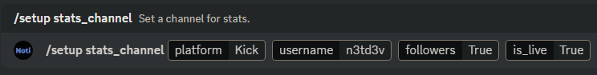

# Commands

On this page you will see a complete list of Noti's commands that you can use on your discord server.

## General Commands&#x20;

<!--<table><thead><tr><th width="222">Command name</th><th>Description</th></tr></thead><tbody><tr><td>/faq</td><td>List of common facts and questions about Noti</td></tr><tr><td>/help</td><td>List all Noti's commands</td></tr><tr><td>/invite</td><td>Will show a link to invite Noti to your server</td></tr><tr><td>/stats</td><td>The bot's current data stats</td></tr><tr><td>/vote</td><td>Vote rewards on Nofi</td></tr><tr><td>/support</td><td>Will show a link to Noti's support sevrer</td></tr><tr><td>/sync</td><td>Sync kick user roles on this server. Must have account linked*</td></tr><tr><td>/panel</td><td>Create a panel for user to click Verify and Sync</td></tr></tbody></table> -->

<table><thead><tr><th width="222">Command Name</th><th>Description</th></tr></thead><tbody><tr><td>/birthday setup</td><td>Setup the birthday system in your server</td></tr><tr><td>/faq</td><td>List of frequently asked questions about Noti</td></tr><tr><td>/help</td><td>List all Noti's commands</td></tr><tr><td>/invite</td><td>Will show a link to invite Noti to your server</td></tr><tr><td>/panel</td><td>Create a panel for user to click Verify and Sync</td></tr><tr><td>/stats</td><td>The bot's current data stats</td></tr><tr><td>/support</td><td>Will show a link to Noti's support server</td></tr><tr><td>/sync</td><td>Sync Kick user roles on this server. Must have account linked*</td></tr><tr><td>/vote</td><td>Vote rewards on Noti</td></tr><tr><td>/language</td><td>Change the language of the bot</td></tr><tr><td>/welcome setup</td><td>Setup welcome messages</td></tr><tr><td>/welcome reset</td><td>Reset welcome messages</td></tr></tbody></table>

## The `/Setup Service` Command & Its Applicable Variables

Click to expand for full display of the <mark style="color:green;">/setup service</mark>&#x20; command variables & descriptions for each

  - **/setup service** | Command to setup the notification service
  - **platform** *(required)* | The platform the streamer streams on
  - **streamer** *(required)* | The streamer's platform username that you want notifications for
  - **channel** *(optional)* | The channel the notifications will be sent to
  - **clip_channel** *(optional)* | Provide the desired channel to send Kick.com clip notifications to
  - **delete_message** *(sub optional)* | Delete live message notification after streamer goes offline
  - **toggle_notify_button** *(optional)* | Toggle notify button on live message notification?
  - **sync_streamer_username** *(optional)* | Should the streamer's username be synced between Kick & Discord?
  - **ping_role** *(optional)* | Define the Discord role to ping when a streamer goes live
  - **subscriber_role** *(optional)* | Define the Discord role for subscriber sync between Kick & Discord
  - **moderator_role** *(optional)* | Define the Discord role for moderator sync between Kick & Discord
  - **verified_by_kick_role** *(sub optional)* | Define the Discord role for verified by Kick sync between Kick & Discord
  - **founder_role** *(sub optional)* | Define the Discord role for founder sync between Kick & Discord
  - **vip_role** *(optional)* | Define the Discord role for VIP sync between Kick & Discord
  - **og_role** *(optional)* | Define the Discord role for OG sync between Kick & Discord
  - **live_role** *(sub optional)* | Define the Discord role assigned/removed based on streamer's live status
  - **live_role_add_user** *(sub optional)* | Define Discord user to add the live role to
  - **live_role_remove_user** *(sub optional)* | Define Discord user to remove the live role from

<!--
<table><thead><tr><th width="222">Command Name</th><th>Description</th></tr></thead><tbody><tr><td>/setup service</td><td>Setup the notification service </td></tr><tr><td> platform (required)</td><td>The platform the streamer streams on</td></tr><tr><td> streamer (required)</td><td>The streamer's platform username that you want notifications for</td></tr><tr><td> channel (Optional)</td><td>The channel the notifications will be sent to</td></tr><tr><td> toggle (Sub Optional)</td><td>Enable or disable the subscribe button </td></tr><tr><td> meantionedrole (Sub Optional)</td><td>The role here will be pinged</td></tr><tr><td> subscriberrole (Optional)</td><td>The role will be given to users who have subscribed to the streamer*</td></tr><tr><td> moderatorrole (Optional)</td><td>The role will be given to users who is a moderator on the streamers stream*</td></tr><tr><td> liverole (Optional)</td><td>The role will be given to users who are the streamer or a part of the stream*</td></tr><tr><td>

 whitelistadd (Sub Optional)
</td><td>Will whitelist a user</td></tr><tr><td>

 whitelistremove (Sub Optional)
</td><td>Will remove whitelist from a user </td></tr></tbody></table>
-->

## The `/Setup Reset` Command & Its Applicable Variables

Visual Example: *(this example uses only the everything variable set to true to reset the notification entirely!)*  \

Click to expand for full display of the <mark style="color:green;">/setup reset</mark>&#x20; command variables & descriptions for each

  - **/setup reset** | Reset the notification service for a streamer
  - **platform** *(required)* | The platformm the streammer streams on
  - **streamer** *(required)* | The streamer's platform username you wish to reset notifications for
  - **everything** (variables: True/False) *(optional)* | Reset everything for the desired streamer?
  - **channel** *(optional)* | Reset the desired channel to send live notification to?
  - **clip_channel** *(optional)* | Reset the desired channel to send Kick.com clip notifications to?
  - **ping_role** *(optional)* | Reset the desired role to ping when a streamer goes live?
  - **subscriber_role** *(optional)* | Reset the defined role for subscriber sync between Kick & Discord?
  - **moderator_role** *(optional)* | Reset the defined role for moderator sync between Kick & Discord?
  - **verified_by_kick_role** *(optional) | Reset the defined role for verified by Kick sync between Kick & Discord?
  - **founder_role** *(optional)* | Reset the defined role for founder sync between Kick & Discord?
  - **vip_role** *(optional)* | Reset the defined role for VIP sync between Kick & Discord?
  - **og_role** *(optional)* | Reset the defined role for OG sync between Kick & Discord?
  - **live_role** *(optional)* | Reset the defined role that is assigned/removed based on streamer's live status?

<!--
<table><thead><tr><th width="222">Command Name</th><th>Description</th></tr></thead><tbody><tr><td>/setup reset</td><td>Reset the notification service for a streamer</td></tr><tr><td>platform (required)</td><td>The platform the streamer streams on</td></tr><tr><td> streamer (required)</td><td>The streamer's platform username you wish to reset notifications for</td></tr><tr><td> everything (variables: True/False) (optional)</td><td>Reset everything for the desired streamer?</td></tr><tr><td>channel (optional)</td><td>Reset the desired channel to send live notifications to</td></tr><tr><td>clip_channel (optional)</td><td>Reset the desired channel to send Kick.com clip notifications?</td></tr><tr><td>ping_role (optional)</td><td>Reset the desired role to ping when a streamer goes live?</td></tr><tr><td>subscriber_role (optional)</td><td>Reset the defined role for subscriber sync between Kick & Discord?</td></tr><tr><td>moderator_role (optional)</td><td>Reset the defined role for moderator sync between Kick & Discord?</td></tr><tr><td>verified_by_kick_role (optional)</td><td>Reset the defined role for verified by Kick sync between Kick & Discord?</td></tr><tr><td>founder_role (optional)</td><td>Reset the defined role for founder sync between Kick & Discord?</td></tr><tr><td>vip_role (optional)</td><td>Reset the defined role for vip sync between Kick & Discord?</td></tr><tr><td>og_role (optional)</td><td>Reset the defined role for og sync between Kick & Discord?</td></tr><tr><td>live_role (optional)</td><td>Reset the defined role that is assigned/removed based on streammer's live status?</td></tr></tbody></table>
-->

## The `/Setup Stats_Channel` Command & Its Applicable Variables

Visual Example: \

Click to expand for full display of the <mark style="color:green;">/setup stats_channel</mark>&#x20; command variables & descriptions for each

  - **/setup stats_channel** | Setup a channel for stats to on or off and to whom
  - **platform** *(required)* | The platform the streamer streams on
  - **username** *(required)* | The name of the streammer you're setting stats up for
  - **followers** (variables: True/False) | Show the streamer's follower count?
  - **is_live** (variables: True/False) | Show the streamer is live or offline?

<!--
<table><thead><tr><th width="222">Command Name</th><th>Description</th></tr></thead><tbody><tr><td>/setup stats_channel</td><td>Setup a channel for stats to on or off and to who</td></tr><tr><td> platform (required)</td><td>The platform the streamer streams on</td></tr><tr><td> username (required)</td><td>The name of the streamer you're setting stats up for</td></tr><tr><td> followers (variables: True/False)</td><td>Show the streamer's follower count </td></tr><tr><td> is_live (variables: True/False)</td><td>Show the streamer live or not?</td></tr></tbody></table>
-->


Note

\* For this to work the user's discord and Kick account need to be linked.&#x20;

