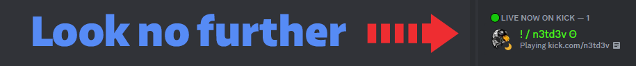

# How to setup a LIVE NOW ON KICK role for your Discord server using Noti

<figure><figcaption></figcaption></figure>

## First Step: In Your Discord

### Create A Discord Live Now Role


 
Make sure that the bot has permission to manage roles **and** that the role the bot is assigning is below the highest role the bot has.


  
Click to expand how to create a Discord live now role

 
  1. You will need to create the Discord role in your server that you wish your community members to be automatically granted anytime they go live on Kick. (e.g.: LIVE NOW ON KICK). *As this autorole is simply a vanity role, we recommend leaving all permissions off by default.)*
  2. (optional) Drag to move the new live now role to the preferred order of your role server's listing; for example, if you want the new role to be at the top of your server's member list, you would drag the live now role to the top of your list of roles. (Reminder: The autorole created by Noti when you previously joined it to your server must always be above even this role in order for the bot to function function as intended!)
  3. (optional) Recommended live now role settings should be **enabled** for `Display role members separately from online members. This will display those currently live on Kick at the location you chose above in optional 2 apart from the other roles.

## Second Step: In the Noti web dashboard


 
If you haven't already, now is a good time to complete the steps above under "First Step: In Your Discord"


  
Click to expand how to setup the second step via Noti's web dashboard

  • Once you have the live now role created in your Discord server, now you can head over and login to the Noti web dashboard.  Select Manage the server you wish to get started in and then press Configure to select Kick as your social category. \
  • On the Streamers panel, you should see Configure next to any streamers you may have previously added. Press Configure to open the streamer's configuration panel; under the General tab, you should see Live Role Sync. 

## Third Step: QoL Features For Your Server Members

### Add the Synchronization panel for your server members


 **Caution**: 
This guide assumes you already have the basic knowledge of the Discord platform and therefore, does not include instructions on how to create a Discord channel where your members can access and use the synchronization panel posted by the Noti tutorial below.


  
Click to expand how to add the Synchronization panel

  
• From the web dashboard, select a server and press `Manage`. Select Kick category by pressing `Configure`. Select Panel from the top right menu. \
• Link and Sync Account: Select a discord channel to post the panel to and press `Send` \
• Congrats! If you have followed along thus far, you have just successfully posted the Noti synchronization panel to your Discord server channel. \
• Your members can now use the panel to link and sync their Kick.com account to your Discord server.

*Premium Option: You can opt to skip Noti voting link for your server by grabbing this addition from your Noti premium dashboard.*

