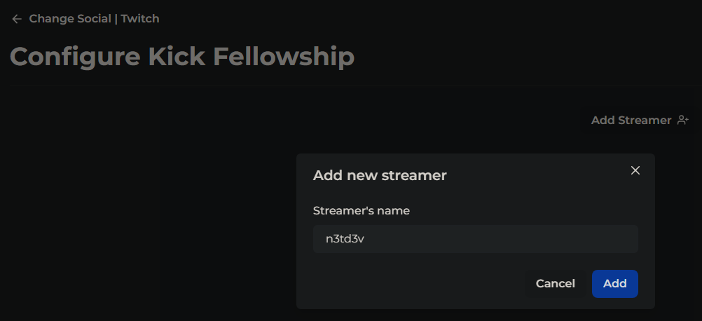
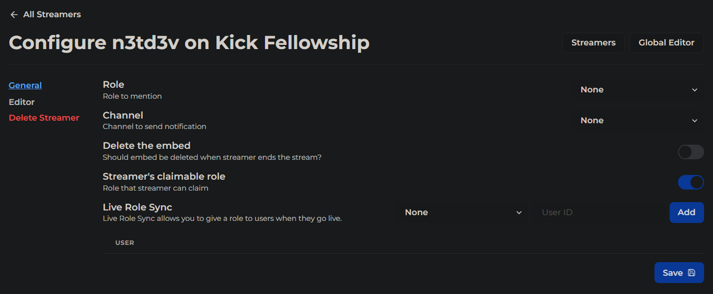

# Basic Setup of Twitch Notifications Using Noti's Dashboard Web Interface

This guide will lead you through the step-by-step process of using Noti's web dashboard for setting up basic Twitch notifications in your Discord server.

# Things you'll need to complete first

 \
You must be logged in to the Noti web dashboard in order to proceed.
<!--You will need to have already completed the [Web Dashboard: Basics & Logging In](dashboard.md) steps before proceeding.-->


## How to select your platform as Twitch

1. Click the **Manage** button directly below the server you wish to setup Noti for receiving Twitch notifications.
2. Next, select the category (or platform) you want to configure Noti for.
3. We will select Twitch; now click the **Configure** button.

## How to Add Streamer(s) you wish receive live notifications for

1. Once you have selected Twitch as your platform as indicated above, click the `Add Streamer` button to add a new streamer.
2. Enter the Twitch streamer's name you wish to receive notifications for, then press `Add`. \
3. Once you have successfully added the streamer, you will be presented with the Configuration window. You can press `Save` here and your basic live notification is now complete! 

If you want to further customize a streamer's live notification, please see the next section of this article for how to configure a streamer's live notifications.

## How to Configure Streamer live notifications

If you're continuing the process of adding a streamer or simply need to make a change to an existing one, this section has you covered with detals on each field available through our Noti dashboard.

### General
  1. Role to mention - select a role to mention/ping when user goes live
  2. Channel to send notification - select a discord channel where Noti will post the live notification
  3. Delete the embed - Should the embed be deleted when streamer ends the stream? (Toggle On/Off, Premium Only)
  4. Streamer's claimable role - Discord role that the streamer can claim (Toggle On/Off)
  5. Live Role Sync - Give a discord role to users when they go live (select Discord role, paste Discord 18-digit user ID, press `Add`)
  6. Press Save.

### Editor
  You can enable Use Streamer Custom Notifications with the Toggle On/Off option and use the Live Notification Customizer to fully customize your Noti live notification experience to meet your demands!

### Delete Streamer
  Remove a streamer's live notifications from your Noti list with this option.
