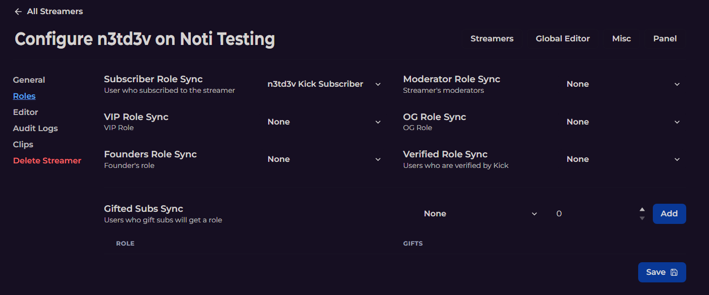

# Noti Dashboard Advanced Setup for Kick notifications

The following illustrations and their corresponding lists break down each section and field as intended for use. 

 
Discord roles that you intend to use for this process must be added prior to starting; otherwise, you will need to refresh the dashboard for them to show up.


 \
   • **General > Role**: The discord role to mention when streamer goes live *(role must already be added to your Discord in order for it  to show on the list)* \
   • **General > Channel**: The discord channel to send the notification to. \
   • **General > Delete the embed**: Should embed be deleted when streamer ends the stream? *(premium only)* \
   • **General > Streamer's claimable role**: Discord role that streamer can claim *(premium only)* \
   • **General > Live Role Sync**: Live Role Sync allows you to give a role to users when they go live. *(premium only)* \
   • **General > Live Cooldown**: Cooldown before next live alert can be sent (in minutes).  Minimum 30 minutes *(server premium plus only)*

 \
   • **Roles > Subscriber Role Sync**: Sync the user who subscribed to the streamer to the defined Discord role \
   • **Roles > Moderator Role Sync**: Sync the streamer's moderators to the defined Discord role \
   • **Role > VIP Sync Role**: Sync the streamer's VIPs to the defined Discord role \
   • **Role > OG Role Sync**: Sync the streamer's OGs to the defined Discord role \
   • **Role > Founders Role Sync**: Sync the streamer's Founders to the defined Discord role \
   • **Role > Verified Role Sync**: Sync users who are verified by Kick to the defined Discord role
   
   • **Editor > Use Streamer Custom Notifications**: Setup and edit fully customizable live notifications and even choose to replace global ones per streamer *(premium only)*

   • **Audit Logs > Streamer Chatroom Audit Actions**: Send events that occur in the streamer's chatroom to a defined Discord channel. *(premium only)*

   • **Clips > Clip Notifications**: Clip notifications get directly sent to a defined Discord channel. *(powered by KickBot)* \
   • **Clips > Clips Forwarding Filters**: Filter created clips notifications you receive according to **Vip**, **Subscriber**, **Moderator** or **Streamer**.

   • **Delete Streamer**: Delete and remove Discord notifications for the selected streamer.

 **Don't forget:** \
Once you're happy with your changes, don't forget to save your work!

