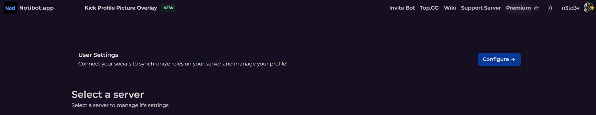
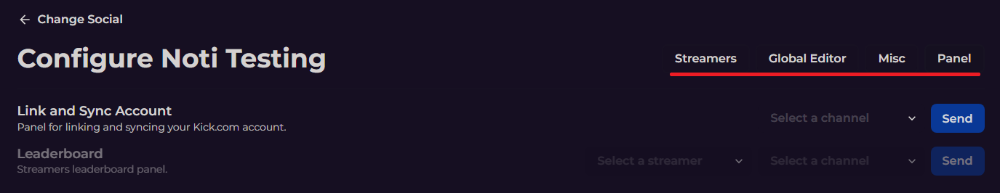
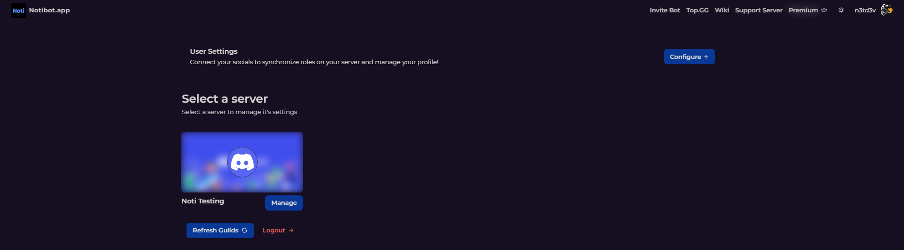

# Noti's Dashboard Web Interface Initialization

In order to receive live notifications in your Discord server, you have two options to choose from for setting up Noti: the slash commands or the web dashboard.

## Web Dashboard Login
This guide will lead you through the step-by-step process of initializing Noti's dashboard web interface:

1. Head over to [https://notibot.app/dashboard](https://notibot.app/dashboard)
2. You will be prompted to sign in with your Discord account if you have not already. \
    • *Signing in with Discord allows Noti to provide you with a list of servers to select from that you have the Manage Server permission for.*
3. Once you have successfully logged in with your Discord, you should see the following screen: \
 

## Accessing User Settings

Click to expand for how to access your user settings!

✔️ Connect your socials to synchronize roles on your server and manage your profile with the Configure button, which gives the following configurable options:
	1. Birthday: Set up your birthday date. Please ensure you are entering the correct date as this cannot be changed later. Format: DD/MM (e.g. 20/12)
	2. Global Language: Set your global language for Noti.
 	3. 
 
	
 <!--
	- **Birthday**: Set up your birthday date. Please ensure you are entering the correct date as this cannot be changed later. Format: DD/MM (e.g. 20/12) \
	- **Global Language**: Set your global language for Noti. \
	- **Kick**: Connect/disconnect your Kick.com account \
	- **Twitch**: Connect/disconnect your Twitch.tv account \
	- **Twitter**: Connect/disconnect your Twitter account \
 -->>

## Add//Manage Your Discord Server

✔️ Provided you have previously completed steps 1, 2 & 3 from the Web Dashboard Login section above, you will be presented with a list of servers that you have **Manage Server** permission for. 
 **Should You Add or Manage a Server?** \
**Add** is for servers you wish to add Noti to \
**Manage** is for servers Noti is already joined to


### 💡 How to Configure Global Settings For Your Server

OPTIONAL: Click to expand for full instructions of Configuring Global Server Settings

1. Select a server you wish to configure via the `Manage` button 
2. Next press the `Configure` button next to the social media account to configure that category 
   
   **[Streamers]** \
	• Add, Configure or Delete any streamer notifications for your server here. \
   **[Global Editor]** \
	• Customize both the global live & offline notifications for your server here. *(premium only)* \
   **[Misc]** \
	• Sync Username - Should usernames be synced? *(Default: disabled; premium only)* \
   **[Panel]** \
	• Link and Sync Account: Select a channel and send the panel for linking & syncing your Kick.com account there. \
	• Leaderboard: Select a streamer & channel to send the streamer's leaderboard panel to. *(premium only)* \
 

### 💡 How To ADD Your Server

Click to expand for full instructions of How To Add A Server

	
1. Click the **Add** button directly below the server logo you wish to add Noti to. 
2. Follow the on screen prompts to add Noti to the server(s) of your choice. 

If you have successfully completed the steps listed above, your dashboard should look similar to the following: \

Upon returning to the [Noti Dashboard](https://notibot.app/dashboard) you will now see a **Manage** button in place of the previous Add button. To do so, follow the information in the next section below for how to manage your server!

 **Warning** \
*Changing the default permissions that Noti is granted is not recommended as it may affect its intended performance or functionality.*


### 💡 How To MANAGE Your Server
[Basic/Essential Setup for Kick **Noti**fications](setup/dashboard/dashboard-setup-for-kick.md) \
[Advanced Setup for Kick **Noti**fications](setup/dashboard/dashboard-advanced-setup-for-kick.md)
