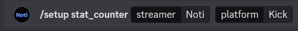

# Streamer Counter

Streamer Counter is used to set up some data channels on your discord, which shows how many "Subscribers" and "Followers" a streamer has.

<figure><figcaption></figcaption></figure>

## How to set up?

1. Use the <mark style="color:green;">`/setup stat_counter`</mark>
2. Write the streamer you want the data from
3. At last, write the platform the streamer is on.&#x20;

<figure><figcaption></figcaption></figure>


**Support**

If you need any help to set up the streamer counter, join our [support server. ](https://discord.com/invite/xq6F6ZkUte)

