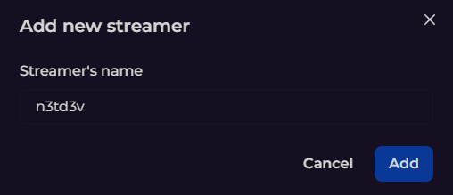
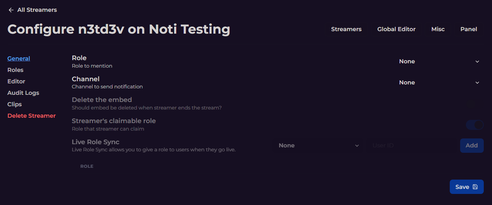

# Setup Kick Notifications Using Noti's Dashboard Web Interface

This guide will lead you through the step-by-step process of using Noti's web dashboard for setting up Kick notifications in your Discord server.

## Web Dashboard Login

1. Head over to (https://notibot.app/dashboard)
2. You will be prompted to sign in with your Discord account if you have not already. \
    • Please note: *Signing in with Discord allows Noti to provide you with a list of servers to select from that you have the Manage Server permission for.*
3. Once you have logged in with Discord, you will be present with a list of servers that you have **Manage Server** permission for.
4. Click the **Add** button directly below the server logo you wish to add Noti to.
5. Follow the on screen prompts to add NotiBot to your desired server.
6. Once you have successfully added Noti to your server, you will need to return to the [Noti Dashboard](https://notibot.app/dashboard) where you will now see a **Manage** button in place of the previous Add Button.   

## Managing Your Discord Server

Please note: *You will need to complete steps 1-6 from the Web Dashboard Login section if you haven't already done so.*

1. Click the **Manage** button directly below the server you wish to setup Noti for.
2. Next, select the category (or platform) you want to configure Noti for.
3. We will select Kick; now click the **Configure** button.

## Adding/Configuring a Streamer to Noti via Web Dashboard

Please note: *You will need to complete all of the previous steps if you haven't already done so.*

1. On the next page, click the **Add Streamer** button to add a new streamer.
2. A popup window will apear as follows; please enter the Kick streamer's name you wish to receive notifications for, then press **Add**.

3. Once you enter the streamer's Kick name that you wish to receive notificaitons for and press the Add button, you will be presented with the Configuration window as follows:

4. The following list breaks down each section and field as intended for use:
   • **General > Role**: The discord role to mention when streamer goes live *(role must already be added to your Discord in order for it  to show on the list)*
   • **General > Channel**: The discord channel to send the notification to.
   • **General > Delete the embed**: Should embed be deleted when streamer ends the stream? *(premium only)*
