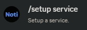
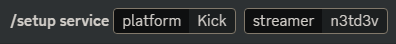

# Setup Kick Notifications In Your Discord Server

You are now ready to setup your first streamer! \
It's super easy and can be done in a few steps.&#x20;

## Simple Setup (required)

> **Note**
\
> This tutorial covers Noti setup for Kick notifications using slash commands.
\
> Alternatively, you can use the web dashboard to setup streamer notifications, which will be covered in a separate help article.

1. Invite [NotiBot](https://notibot.app/invite) if you haven't already done so.

Now you must configure the bot to send alerts to a desired channel.

2. First, you need to use the command <mark style="color:green;">**`/setup service`**</mark>&#x20;

<!--  -->
> **Note**
\
> Required fields to be used in the setup service message:

\3.*(required)* **Platform**: Select Kick for your platform 
\4. *(required)* **Streamer**: Select the Kick.com streamer name to announce

Your command should look something like this:
\

> **Note**
\
> Optional fields to be used in the setup service message:
5. **Channel**: Enter the name of the channel you want the notifications to be posted to.
> 
<!-- 3. **STREAMER:** Then select the "_Streamer_" option. _(Required)_\
   In here you have to put the streamername from Kick.com \
   _-> Go to Kick.com_ \
   _-> Find the streamer you want notifications from_\
   _-> Copy the streamers username_&#x20;
-->
<!--4. **CHANNEL:** Write the name of the channel you want the notifications to be posted. _(Optional)_ -->

And you are now ready to get notifications from your first streamer. Congratulations!

## Advanced Setup (optional)

1. Do the **1-3 steps** of the Simple Setup above.
2. **TOGGLE:** This option will enable or disable a "subscribe button" at a notification. _(Sub Optional)_
3. **MENTIONEDROLE:** Use this option to ping a role, when the choosen streamer goes live. _(Sub Optional)_
4. **SUBSCRIBERROLE:** Use this option if you want Noti to automatically assign a role to the streamer's subscribers. _(Optional)_
5. **MODERATORROLE:**  Use this option if you want Noti to automatically assign a role a moderator of the streamer. _(Optional)_
6. **LIVEROLE:** Use this option if you want to give the streamer or someone who is a part of the stream a role. _(Optional)_
   1. **WHITELISTADD:** _(Sub Optional)_
   2. **WHITELISTREMOVE:** _(Sub Optional)_

<figure><figcaption></figcaption></figure>


**Support**

If you need any help to set up a streamer, join our [support server. ](https://discord.com/invite/xq6F6ZkUte)


