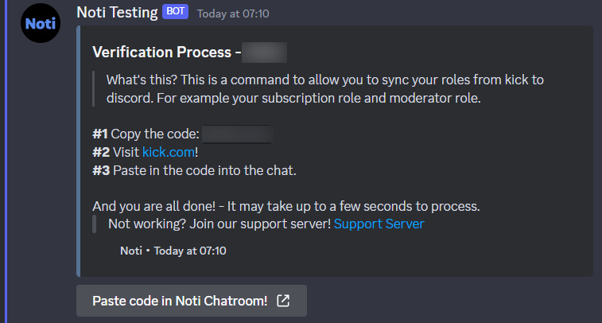

# Verify and Sync

Sometimes it can be nice to have the rings done automatically for you. Therefore, you can use the Verify and Sync commands.

## Verify

The <mark style="color:green;">`/verify`</mark> command will allow you to sync your roles from kick to discord. For example your subscription role and moderator role.

### How to?

Use the <mark style="color:green;">`/verify`</mark> command and a embed will show.&#x20;

The embed will tell you what to do.&#x20;

<figure><figcaption></figcaption></figure>

1. Copy the code. This is a personal code that will change from person to person.
2. Visit [kick.com](https://kick.com/noti/chatroom) this link will take you to a chatroom
3. Paste in the cose into the chat.

## Sync

Before you can sync between discord and kick, you need to do the /verify command.&#x20;

Are you unsure if you have done this? Then you can use the <mark style="color:green;">`/sync`</mark> command.

When you use the Sync command, Noti will tell you if all your roles is synchronize from kick.com to discord.&#x20;


**Support**

If you need any help, join our [support server. ](https://discord.com/invite/xq6F6ZkUte)

